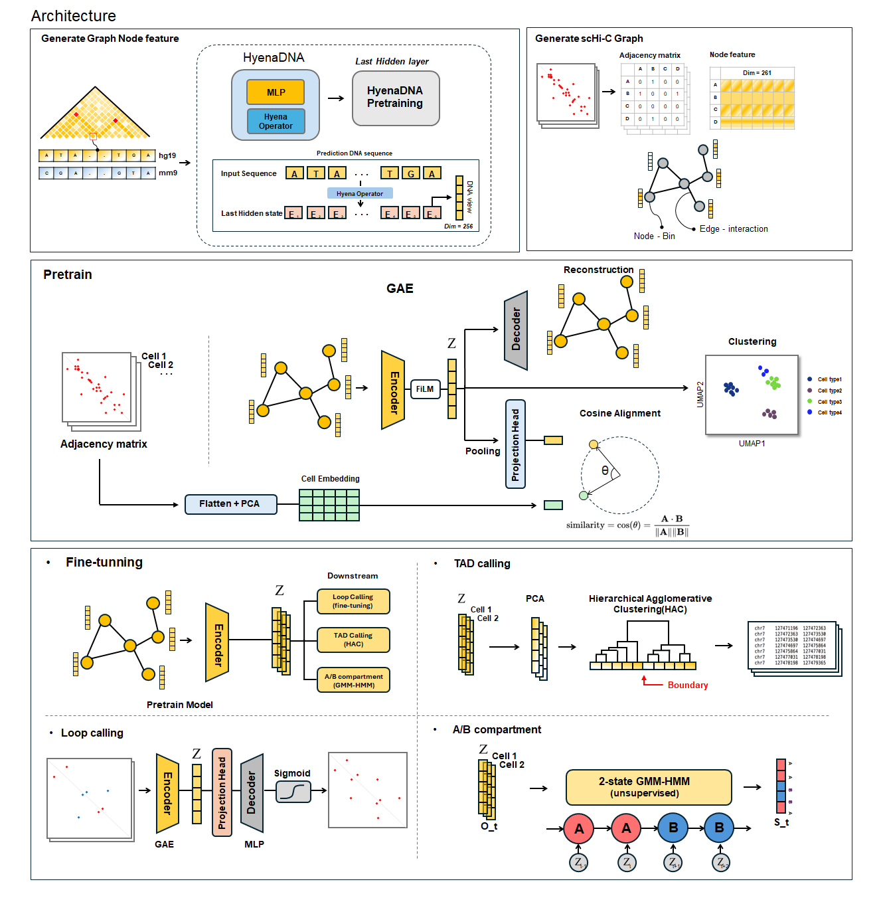
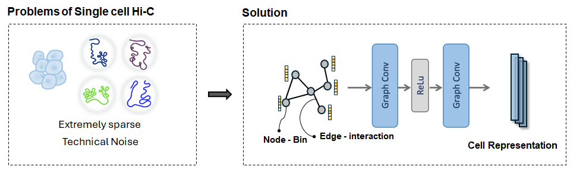
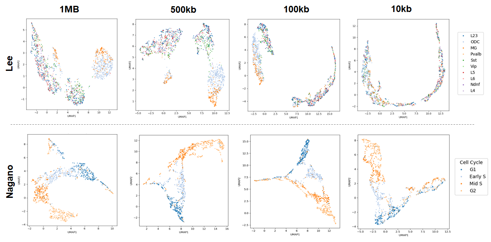
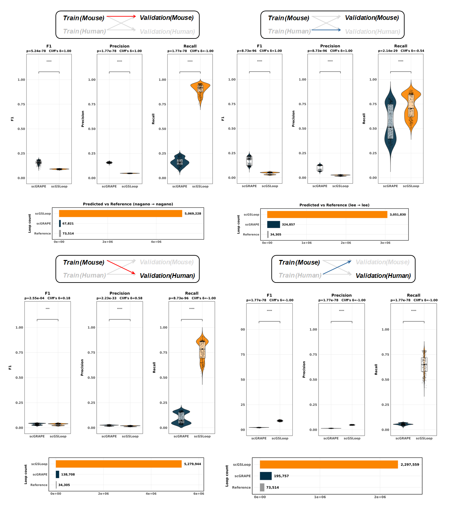

# scGRAPE: Graph Representation and Anchor Pair Extraction for scHi-C

**scGRAPE** is a graph-based deep learning framework for analyzing single-cell Hi-C (scHi-C) data.
It reconstructs sparse chromatin contact graphs and predicts higher-order chromatin structures,
including **chromatin loops**, **topologically associating domains (TADs)**, and **A/B compartments**,
using a unified graph representation learning strategy.

This repository provides an end-to-end pipeline from raw scHi-C contact matrices to downstream
3D genome structure inference.

<p align="center">
  
</p>

---

## Background

<p align="center">
  
</p>

- Single-cell Hi-C (scHi-C) enables the investigation of 3D genome organization at single-cell resolution, but its extreme sparsity and noise severely limit the recovery of meaningful chromatin interaction signals and the interpretation of cell-to-cell structural variability.
- To address this challenge, **scGRAPE** reformulates scHi-C contact maps as graphs and applies a Graph Autoencoder (GAE)-based representation learning framework to model sparse chromatin interaction topology.
- By integrating sequence embeddings derived from the large-scale DNA foundation model **HyenaDNA** as node features, scGRAPE incorporates sequence-level structural priors beyond raw contact intensity.
- The learned latent space consistently captures biologically meaningful variations in 3D genome architecture across cells and resolutions.
- Furthermore, scGRAPE enables unified downstream analyses—including chromatin loop prediction, TAD boundary detection, and A/B compartment inference—within a single, coherent latent representation framework.

--- 

## Usage

scGRAPE provides a modular pipeline for learning cell-level representations of 3D genome organization from single-cell Hi-C (scHi-C) data. Dataset-specific preprocessing is performed once, after which all downstream analyses operate on a unified graph representation.

### 1. Preprocess raw scHi-C data

Convert heterogeneous raw scHi-C formats into a standardized, chromosome-wise sparse matrix representation (.npz), and compute cell-level embeddings used for cosine alignment during training.

```code
python scripts/preprocess_lee.py --help
python scripts/preprocess_nagano.py --help
```
- Details: `src/preprocessing/README.md`

### 2. Construct node features
Build node features for each genomic bin using sequence- and structure-derived information.

```code
python scripts/embed_dna_hyenadna.py
python scripts/compute_ldp.py
python scripts/merge_ldp_dna.py
```
- Details: `src/features/README.md`

### 3. Build scHi-C graphs
Combine standardized contact matrices and node features into per-(cell, chromosome) graph objects compatible with PyTorch Geometric (.pt).

```code
python scripts/preprocess_lee.py --help
python scripts/preprocess_nagano.py --help
```

### 4. Train the model
Model training is performed in two stages: pretraining for representation learning and fine-tuning for loop prediction.

#### Pretraining
`pretrain_gae.py` trains a Graph Autoencoder (GAE-FiLM) on scHi-C graphs to learn
node and graph-level latent representations.

- Optimizes **graph reconstruction (BCE)**
- Includes **cosine alignment to PCA-based cell embeddings** to encode cell-level structural variation

```code
python scripts/pretrain_gae.py [-h]
required arguments:
    --dataset {lee,nagano,pt}       Dataset type
    --train_dir TRAIN_DIR           Directory containing training .pt graphs
    --val_dir VAL_DIR               Directory containing validation .pt graphs
    --out_dir OUT_DIR               Output directory for checkpoints and logs

optional arguments:
  --cell_emb_dir CELL_EMB_DIR      Directory with cell_embeddings.npy and cell_names.txt
  --epochs EPOCHS                  Number of training epochs (default: 150)
  --lr LR                          Learning rate (default: 1e-3)
  --hidden_dim HIDDEN_DIM          Encoder hidden dimension (default: 128)
  --z_dim Z_DIM                    Latent embedding dimension (default: 32)
```

#### Fine-tuning (Loop prediction)
`finetune_loops.py` loads a pretrained model, attaches a loop prediction head,
and optimizes a multi-task objective.
- Reconstruction, cosine alignment, and loop BCE loss
- Supervised fine-tuning using reference chromatin loops

```code
python scripts/finetune_loops.py [-h]
required arguments:
  --train_dir TRAIN_DIR            Directory containing training .pt graphs
  --val_dir VAL_DIR                Directory containing validation .pt graphs
  --label_path LABEL_PATH          Dataset-specific label/metadata file
  --cell_emb_dir CELL_EMB_DIR      Directory with PCA-based cell embeddings
  --ref_loop_path REF_LOOP_PATH    Reference loop file (.pt)
  --pretrain_model PRETRAIN_MODEL  Path to pretrained model checkpoint
  --out_dir OUT_DIR                Output directory for fine-tuned models
```

### 5. Inference & Downstream Analysis
scGRAPE supports multiple downstream analyses from pretrained or fine-tuned models. All inference steps operate on either scHi-C graphs (`.pt`) or latent embeddings (`.z.npz`) and are designed as standalone CLI tools.

#### 1) Loop Prediction
Predict chromatin loops using a loop-fine-tuned scGRAPE model.
```code
python scripts/predict_loops.py [-h]
  --pt_dir PT_DIR                  Directory containing .pt graphs (val/test)
  --label_path LABEL_PATH          Dataset-specific label/metadata file
  --weights WEIGHTS                Fine-tuned loop model checkpoint (.pt)
  --out_dir OUT_DIR                Output directory for loop predictions
```

#### 2) TAD Boundary Detection
Extract TAD boundaries from latent node embeddings (`.z.npz`).
```code
python scripts/downstream/tad_from_z.py [-h]
required arguments:
  --z_dir Z_DIR                    Directory containing *.z.npz files
  --out_dir OUT_DIR                Output directory

optional arguments:
  --binsize INT                    Bin size in bp (default: 10000)
  --avg_tld_size_bins INT          Expected TLD size (bins)
  --linkage STR                    Clustering linkage method (default: ward)
  --use_pca                        Apply PCA before clustering
  --pca_ncomp INT                  Number of PCA components
  --ctcf_bed PATH                  CTCF motif BED file (optional)
  --ctcf_window_bp INT             CTCF refinement window (bp)
  --consensus_vote FLOAT           Consensus vote threshold
  --consensus_min_sep_bins INT     Minimum boundary separation (bins)
```
#### 3) A/B Compartment
Compartment analysis is performed in two steps: (i) training a GMM-HMM and (ii) applying it to latent embeddings.

-  **Train GMM-HMM for compartment calling**
```code
python scripts/train_compartment_hmm.py [-h]
required arguments:
  --z_dir Z_DIR                    Directory containing z embedding files
  --out_dir OUT_DIR                Output directory for trained models

optional arguments:
  --hmm_iter INT                   Number of HMM iterations (default: 100)
  --train_max_seqs INT             Maximum training sequences
  --seed INT                       Random seed
  --standardize                    Standardize embeddings before training
  --pca_dim INT                    PCA dimension (0 to disable)
```
- **Infer A/B compartments**
```code
python python scripts/downstream/compartment_from_z.py [-h]
required arguments:
  --z_dir Z_DIR                    Directory containing *.z.npz files
  --model_dir MODEL_DIR            Directory with trained GMM-HMM
  --out_dir OUT_DIR                Output directory
  --chrom_sizes PATH               Chromosome sizes file
  --gc_table PATH                  GC content table

optional arguments:
  --resolution INT                 Bin resolution (default: 10000)
  --coarsen_factor INT             Coarsening factor
  --float_format STR               Output float format
```

## Results

### 1) Cell structure and clustering patterns in latent space
<p align="center">
  
</p>

- Latent embeddings were extracted from pretrained models and clustered across multiple resolutions (1 Mb, 500 kb, 100 kb, 10 kb).
- In the Nagano mouse embryonic stem cell dataset, latent embeddings formed a continuous trajectory corresponding to cell-cycle progression (G1 → early S → mid S → G2), indicating that scGRAPE preserves dynamic biological structure in latent space.
- In the Lee human prefrontal cortex dataset, major glial cell types (e.g., oligodendrocytes and microglia) were clearly separable, whereas neuronal subtypes were not reliably resolved in the latent space.
- As resolution increased, extreme sparsity in scHi-C data reduced cluster separability, highlighting fundamental limits imposed by single-cell contact sparsity.


### 2) Loop prediction after fine-tuning

<p align="center">
  
</p>
